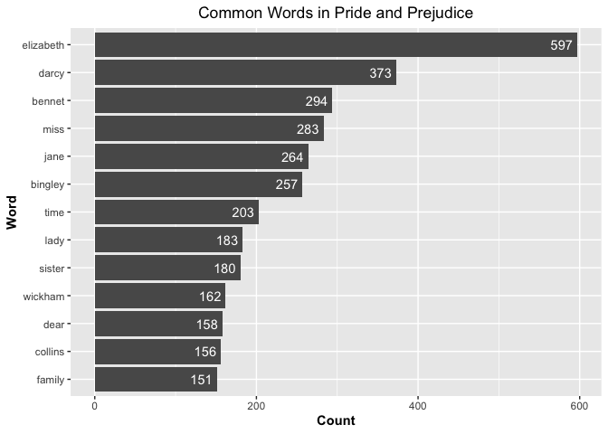

STAT 545B Assignment B4 Exercise 1
================

Reference:
<https://dk81.github.io/dkmathstats_site/rtext-freq-words.html>
Stopwords from: tidytext::stop_words

``` r
library(dplyr)
```

    ## 
    ## Attaching package: 'dplyr'

    ## The following objects are masked from 'package:stats':
    ## 
    ##     filter, lag

    ## The following objects are masked from 'package:base':
    ## 
    ##     intersect, setdiff, setequal, union

``` r
library(tidytext)
library(ggplot2)
library(janeaustenr)
```

``` r
# Data frame: Pride and Prejudice from Jane Austen
pride_prejudice <- tibble(Text = janeaustenr::prideprejudice)
head(pride_prejudice)
```

    ## # A tibble: 6 × 1
    ##   Text                 
    ##   <chr>                
    ## 1 "PRIDE AND PREJUDICE"
    ## 2 ""                   
    ## 3 "By Jane Austen"     
    ## 4 ""                   
    ## 5 ""                   
    ## 6 ""

``` r
# Picks individual words and places them as rows
pride_prejudice_words <- pride_prejudice %>% 
                  unnest_tokens(output = word, input = Text) 
head(pride_prejudice_words)
```

    ## # A tibble: 6 × 1
    ##   word     
    ##   <chr>    
    ## 1 pride    
    ## 2 and      
    ## 3 prejudice
    ## 4 by       
    ## 5 jane     
    ## 6 austen

``` r
# Remove stopwords using anti_join()
# Then convert into a work count tibble
pride_prejudice_words <- pride_prejudice_words %>%
                   anti_join(stop_words) %>% 
                   count(word, sort = TRUE)
```

    ## Joining, by = "word"

``` r
head(pride_prejudice_words)
```

    ## # A tibble: 6 × 2
    ##   word          n
    ##   <chr>     <int>
    ## 1 elizabeth   597
    ## 2 darcy       373
    ## 3 bennet      294
    ## 4 miss        283
    ## 5 jane        264
    ## 6 bingley     257

``` r
# Plot the most common words
pride_prejudice_words %>% 
  filter(n > 150) %>% # Pick word with more than 150 counts
  mutate(word = reorder(word, n)) %>% 
    ggplot(aes(word, n)) + 
    geom_col() +
    coord_flip() +
    labs(x = "Word", y = "Count", title = "Common Words in Pride and Prejudice") +
    geom_text(aes(label = n), colour = "white", hjust = 1.2) +
    theme(plot.title = element_text(hjust = 0.5), 
        axis.title.x = element_text(face="bold"),
        axis.title.y = element_text(face="bold"))
```

<!-- -->
